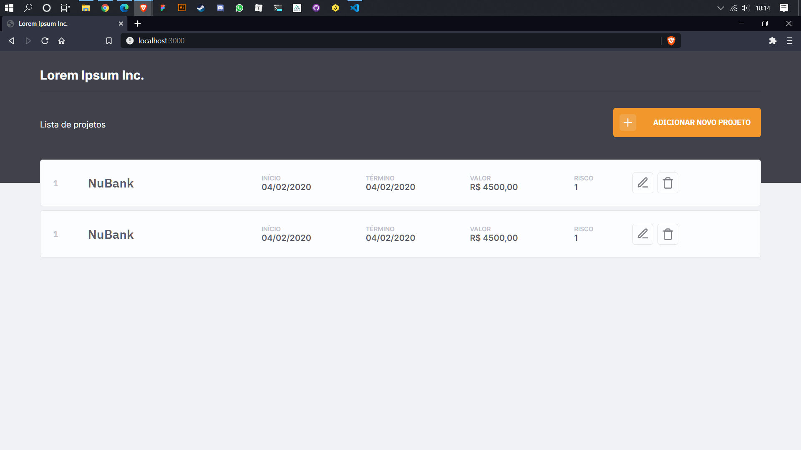

# Lorem Ipsum Inc.

<h2 align="center">
  
</h2>
<br/>
<br/>

## Clonando e executando em sua máquina.

Após fazer o download do projeto para sua máquina, execute os seguintes comando:

- para instalar os pacotes nescessários.

```
$ npm install
```

- para rodar o projeto.

```
$ npm run dev
```

Após feitos os passos a cima, no browser, acesse "localhost:3000".
Rotas:

- localhost:3000/
- localhost:3000/job
- localhost:3000/job/edit
